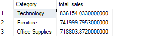
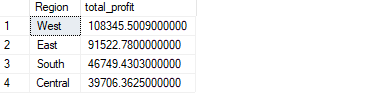
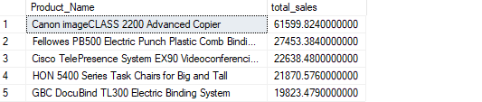

# 📊 SQL Sales Analysis

## 📌 Overview
This project analyzes a retail sales dataset using SQL Server Management Studio (SSMS). The goal is to extract meaningful business insights related to sales performance, profitability, customer behavior, and product trends.

---

## 🛠 Tools Used
- SQL Server Management Studio (SSMS)
- SQL
- CSV Dataset (Superstore Sales)

---

## 📂 Dataset Description
The dataset contains retail order data including:
- Order Date
- Customer Name
- Product Category and Sub-Category
- Sales and Profit
- Region

---

## 🔍 Business Questions Answered
- What are the total sales and total profit?
- Which categories generate the most revenue?
- Which regions are the most profitable?
- What are the top-performing products?
- Which customers contribute the most revenue?
- Which products are generating losses?

---

## 📊 Key Insights
- A small number of products contribute a large percentage of total sales.
- Certain regions generate significantly higher profit than others.
- Some products consistently generate negative profit, indicating potential pricing or discount issues.
- Sales trends vary over time, showing possible seasonal patterns.

---

## 📸 Sample Outputs

### Sales by Category

### Profit by Region

### Top Products by Sales

---

## 📁 Project Structure
sql-sales-analysis/
│── README.md
│── data/
│── sql/
│── images/

---

## ▶️ How to Run
1. Import the dataset into SQL Server.
2. Open `analysis_queries.sql` in SSMS.
3. Execute queries to reproduce results.

---

## 👨‍💻 Author
Hamim Shafin
